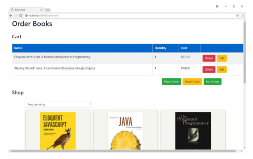
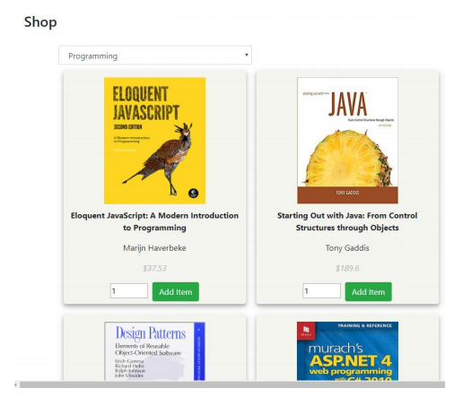
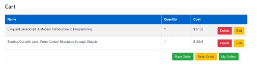
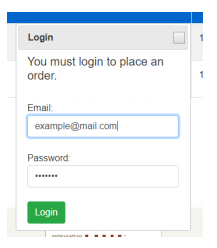
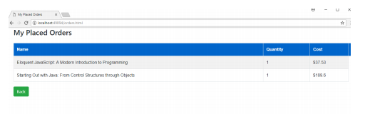

# BookStore

## Overview
This app is an online bookstore using a Web API to keep track of orders and accounts. You can browse through books, order them in bulk, edit/delete your orderds, and confirm them. You must sign in to an account to confirm/place orders.
 

 
 

## Shopping
In the bottom section you can browse through a selection of programming related books and add any of them to your cart. There is also a number picker to select a quantity of books that you want to order.
 

 
 

## Cart
At the top of the page you can view the items that are currently in your cart. For each item there is an option to edit the quantity of books or delete the item from the cart. You can clear all items from the cart by clicking on "Reset Order". You can also confirm the order by clicking on "Place Order". This will require you to enter your username and password after which the items in the cart will be removed and sent to the "My Orders" page.
 

 
 

## Place Orders
Clicking on the "Place Order" button will pop up a login page. User IDs are used to keep track of who ordered what. I have provided 2 example users (example@mail.com, example) and (user@mail.com, password).
 

 
 

## My Orders Page
Once you have placed the order, you can navigate to the "My Orders" page by clicking on "My Orders". You will be required to sign in again. Here you can view every order that has been placed with the login credentials.
 

 
 
